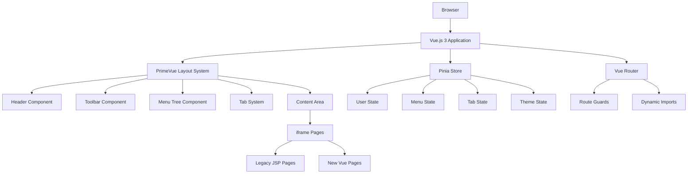

# MES UI 프레임워크 설계 문서

## 개요

본 문서는 Vue.js 3와 PrimeVue를 기반으로 구축되는 현대적인 웹 기반 MES UI 프레임워크의 종합적인 설계를 다룹니다. 이 프레임워크는 제조 실행 시스템 애플리케이션을 위한 일관성 있고 반응형이며 접근 가능한 사용자 인터페이스를 제공하며, Phase 1-2 (기반 구조 설계 및 핵심 컴포넌트 개발)와 Phase 3-4 (탭 시스템 및 반응형 최적화) 개발 단계를 모두 지원합니다.

설계는 현대적인 웹 표준과 접근성 가이드라인을 준수하면서 성능, 유지보수성, 사용자 경험을 강조합니다.

### 프로젝트 목적 및 일정
- **목적**: 기존 MES 시스템 재개발을 위한 UI 프레임워크 개발
- **전체 기간**: 3개월
- **개발 우선순위**: 레이아웃 → 헤더 → 툴바 → 메뉴 → 탭
- **성능 목표**: 페이지 로딩 3초 이내, 탭 전환 2초 이내
- **동시 사용자**: 100명 (전체 1000명)

## 아키텍처

### 기술 스택

**프론트엔드 프레임워크:**
- **Vue.js 3** with Composition API and `<script setup>` syntax
- **PrimeVue** for UI components and design system
- **Pinia** for state management
- **Vue Router** for navigation and routing

**빌드 도구:**
- **Vite** for fast development and optimized builds
- **TypeScript** for type safety and better developer experience
- **Sass/SCSS** for advanced styling capabilities

**개발 도구:**
- **ESLint** and **Prettier** for code quality
- **Vitest** for unit testing
- **Cypress** for end-to-end testing

### 기술 아키텍처 요구사항
- **기본 방식**: 멀티페이지 (SPA 방식도 염두)
- **브라우저 지원**: Chrome, Edge (Internet Explorer 미지원)
- **성능 목표**: 페이지 로딩 3초 이내, 탭 전환 2초 이내
- **동시 사용자**: 100명 (전체 1000명)
- **보안 제약**: CDN 사용 금지, 특정 포트만 사용
- **연동**: EAI 시스템 연동 필요

### 전체 레이아웃 구조

```
┌─────────────────────────────────────────────────────────────┐
│                        헤더 영역                           │
│ [메뉴] [회사CI]                    [사용자정보] [전화번호] [원격] │
├──┬──────────────────────────────────────────────────────────┤
│툴│                    메인 콘텐츠 영역                      │
│바│  ┌─────────────────────────────────────────────────────┐ │
│ │  │      탭 바 (홈, 메뉴1, 메뉴2, ...)              │ │
│아│  ├─────────────────────────────────────────────────────┤ │
│이│  │                                                 │ │
│콘│  │                화면 컨텐츠                      │ │
│ │  │                                                 │ │
│ │  │                                                 │ │
│ │  │                                                 │ │
│ │  └─────────────────────────────────────────────────────┘ │
└──┴──────────────────────────────────────────────────────────┘
```

### 시스템 아키텍처



### 반응형 동작
- **데스크톱**: 툴바 항상 표시
- **태블릿/모바일**: 툴바 → 햄버거 메뉴로 변환
- **탭 오버플로우**: 좌우 스크롤 처리
- **콘텐츠 오버플로우**: 세로/가로 스크롤 처리

### 반응형 브레이크포인트
| 화면 크기 | 툴바 | 탭 바 | 메뉴 트리 |
|----------|------|-------|-----------|
| 데스크톱 | 고정 표시 | 수평 배치 | 사이드바 |
| 태블릿 | 햄버거 메뉴 | 수평 스크롤 | 오버레이 |
| 모바일 | 햄버거 메뉴 | 수평 스크롤 | 전체 화면 |

### Component Hierarchy

```
MESApp
├── MainLayout (Custom Layout with PrimeVue)
│   ├── HeaderComponent
│   │   ├── GlobalMenuDialog
│   │   ├── CompanyLogo
│   │   ├── UserInfoMenu
│   │   ├── ContactList
│   │   └── RemoteSupport
│   ├── ToolbarComponent (Drawer)
│   │   ├── ToolbarIcon[]
│   │   └── ToolbarTooltip
│   ├── MenuTreeComponent
│   │   ├── Tree (PrimeVue)
│   │   ├── InputText (Search)
│   │   └── ToggleButton (Favorites)
│   ├── TabSystemComponent
│   │   ├── TabView (PrimeVue)
│   │   ├── TabPanel[]
│   │   └── TabOverflowControls
│   └── ContentAreaComponent
│       ├── HomeTab
│       └── IframeContainer[]
```

## 테마 및 디자인 시스템

### 디자인 철학
1. **명확성 (Clarity)**: 정보 전달이 명확하고 직관적
2. **효율성 (Efficiency)**: 빠르고 정확한 업무 처리 지원
3. **일관성 (Consistency)**: 모든 화면에서 통일된 경험
4. **접근성 (Accessibility)**: 모든 사용자가 쉽게 접근 가능
5. **확장성 (Scalability)**: 미래 요구사항에 유연하게 대응

### 다크 테마 색상 시스템

#### 기본 색상 팔레트
```css
:root {
  /* Primary Backgrounds */
  --bg-primary: #0f172a;      /* 메인 배경 - 깊은 슬레이트 */
  --bg-secondary: #1e293b;    /* 카드/패널 배경 */
  --bg-tertiary: #334155;     /* 호버/활성 상태 */
  
  /* Surface Colors */
  --surface-1: #475569;       /* 입력 필드, 버튼 */
  --surface-2: #64748b;       /* 테두리, 구분선 */
  --surface-3: #94a3b8;       /* 비활성 요소 */
  
  /* Text Colors */
  --text-primary: #f8fafc;    /* 주요 텍스트 */
  --text-secondary: #e2e8f0;  /* 보조 텍스트 */
  --text-tertiary: #cbd5e1;   /* 캡션, 라벨 */
  --text-muted: #94a3b8;      /* 비활성, 플레이스홀더 */
  
  /* Brand Colors */
  --primary: #3b82f6;         /* 메인 브랜드 색상 */
  --primary-hover: #2563eb;   /* 호버 상태 */
  --primary-light: #93c5fd;   /* 연한 톤 */
  --secondary: #64748b;       /* 보조 브랜드 */
  --accent: #f59e0b;          /* 강조색 */
  
  /* Status Colors */
  --success: #10b981;         /* 성공 */
  --warning: #f59e0b;         /* 경고 */
  --error: #ef4444;           /* 에러 */
  --info: #06b6d4;            /* 정보 */
}
```

#### 라이트 테마 지원
```css
[data-theme="light"] {
  --bg-primary: #ffffff;
  --bg-secondary: #f8fafc;
  --bg-tertiary: #f1f5f9;
  --text-primary: #0f172a;
  --text-secondary: #334155;
  --text-muted: #64748b;
}
```

### 타이포그래피 시스템

#### 폰트 패밀리
```css
:root {
  /* Sans-serif (UI 기본) */
  --font-sans: 'Pretendard Variable', 'Pretendard', 
               'Noto Sans KR', 'Malgun Gothic', 
               -apple-system, BlinkMacSystemFont, sans-serif;
  
  /* Monospace (코드, 데이터) */
  --font-mono: 'JetBrains Mono', 'Fira Code', 
               'Consolas', monospace;
  
  /* Barcode (바코드 전용) */
  --font-barcode: 'Libre Barcode 39', 'Code 39', monospace;
}
```

#### 폰트 크기 체계
```css
:root {
  --text-xs: 0.75rem;    /* 12px - 캡션 */
  --text-sm: 0.875rem;   /* 14px - 작은 텍스트 */
  --text-base: 1rem;     /* 16px - 기본 텍스트 */
  --text-lg: 1.125rem;   /* 18px - 강조 텍스트 */
  --text-xl: 1.25rem;    /* 20px - 소제목 */
  --text-2xl: 1.5rem;    /* 24px - 제목 */
  --text-3xl: 1.875rem;  /* 30px - 큰 제목 */
  
  /* Line Heights */
  --leading-tight: 1.25;   /* 제목용 */
  --leading-normal: 1.5;   /* 본문용 */
  --leading-relaxed: 1.625; /* 긴 텍스트용 */
}
```

### 간격 및 레이아웃 시스템

#### Spacing Scale (4px 기준)
```css
:root {
  --space-1: 0.25rem;   /* 4px */
  --space-2: 0.5rem;    /* 8px */
  --space-3: 0.75rem;   /* 12px */
  --space-4: 1rem;      /* 16px */
  --space-6: 1.5rem;    /* 24px */
  --space-8: 2rem;      /* 32px */
  --space-12: 3rem;     /* 48px */
  
  /* Semantic Spacing */
  --gap-sm: var(--space-2);
  --gap-md: var(--space-4);
  --gap-lg: var(--space-6);
}
```

#### Layout Grid
```css
:root {
  /* Component Sizes */
  --header-height: 60px;
  --toolbar-width: 70px;
  --menu-tree-width: 280px;
  --tab-height: 45px;
}
```

### 애니메이션 및 전환

#### 전환 시스템
```css
:root {
  /* Transition Durations */
  --transition-fast: 150ms;
  --transition-normal: 200ms;
  --transition-slow: 300ms;
  
  /* Easing Functions */
  --ease-in-out: cubic-bezier(0.4, 0, 0.2, 1);
  --ease-bounce: cubic-bezier(0.68, -0.55, 0.265, 1.55);
}

/* 툴바 아이콘 애니메이션 (90도 회전) */
.toolbar-icon {
  transition: transform var(--transition-normal) var(--ease-in-out);
}

.toolbar-icon:hover {
  transform: rotate(90deg);
}

/* 호버 효과 */
.interactive {
  transition: var(--transition-normal);
}

.interactive:hover {
  transform: translateY(-2px);
  box-shadow: 0 8px 25px rgba(0, 0, 0, 0.15);
}
```

### 아이콘 시스템

#### 추천 아이콘 라이브러리
1. **Lucide React** ⭐ (1순위) - 깔끔한 outline 스타일
2. **Heroicons** (2순위) - outline과 solid 버전

#### MES 특화 아이콘 매핑
```javascript
const mesIcons = {
  // 대단위 업무
  home: 'Home',
  production: 'Factory',
  quality: 'Shield-check',
  equipment: 'Settings',
  inventory: 'Package',
  planning: 'Calendar',
  reporting: 'Bar-chart-3',
  
  // 네비게이션
  menu: 'Menu',
  search: 'Search',
  expand: 'Chevron-down',
  close: 'X',
  
  // 액션
  add: 'Plus',
  edit: 'Pencil',
  delete: 'Trash-2',
  save: 'Save',
  
  // 상태
  success: 'Check-circle',
  warning: 'Alert-triangle',
  error: 'X-circle',
  info: 'Info'
};
```

## Components and Interfaces

### 1. Layout System (Custom Layout with PrimeVue)

**Design Pattern:** Custom layout using CSS Grid and Flexbox with PrimeVue components
```typescript
// Layout configuration using CSS Grid
const layoutConfig = {
  areas: `
    "header header header"
    "toolbar menu content"
    "toolbar menu content"
  `,
  columns: '80px 300px 1fr',
  rows: '60px 1fr'
}
```

**Responsive Breakpoints (Tailwind CSS compatible):**
```typescript
interface BreakpointConfig {
  xs: 0,      // 0px and up
  sm: 640,    // 640px and up  
  md: 768,    // 768px and up
  lg: 1024,   // 1024px and up
  xl: 1280,   // 1280px and up
  '2xl': 1536 // 1536px and up
}
```

### 2. Header Component (헤더 영역)

#### 헤더 구성 요소
```
┌─────────────────────────────────────────────────────────────┐
│ [≡] [회사CI]              [사용자정보] [담당자번호] [원격요청] │
└─────────────────────────────────────────────────────────────┘
```

**Component Structure:**
```vue
<template>
  <div class="mes-header flex items-center justify-between p-4 bg-surface-0 border-b border-surface-200" style="height: 60px;">
    <div class="flex items-center gap-4">
      <!-- 전체 메뉴 아이콘 (≡) -->
      <Button 
        icon="pi pi-bars"
        text
        rounded
        @click="toggleGlobalMenu"
        class="global-menu-btn"
        aria-label="전체 메뉴"
      />
      
      <!-- 회사 CI -->
      <div class="company-logo">
        <span class="text-lg font-bold">DONGKUK CM</span>
      </div>
    </div>
    
    <div class="flex items-center gap-2">
      <!-- 사용자 정보 영역 -->
      <user-info-menu />
      <!-- 담당자 전화번호 -->
      <contact-list />
      <!-- 원격요청 -->
      <remote-support />
    </div>
  </div>
</template>
```

#### 전체 메뉴 아이콘 (≡) 상세
- **위치**: 헤더 좌측 최상단
- **기능**: 클릭 시 전체 메뉴 모달 창 표시
- **모달 구성**:
  - 상단: 검색창, 전체보기 토글, 즐겨찾기 토글
  - 좌측: 대단위 업무명 목록
  - 우측: 선택된 업무의 세부 메뉴 (3단 구조)
  - 즐겨찾기: 메뉴명 옆 별표(★) 표시

#### 회사 CI
- **위치**: 헤더 좌측 (전체 메뉴 옆)
- **기능**: 클릭 불가 (장식 요소)
- **크기**: 고정 크기

#### 사용자 정보 영역
- **구성**: 아바타 + 소속명 + 사용자명
- **기능**: 
  - 클릭 시 드롭다운 메뉴
  - 사용자 설정, 로그아웃 기능
  - 메시지함 기능

```vue
<template>
  <div class="user-info-menu relative">
    <Button
      @click="toggleUserMenu"
      class="flex items-center gap-2 p-2"
      text
    >
      <div class="avatar w-8 h-8 bg-primary rounded-full flex items-center justify-center text-white text-sm">
        장
      </div>
      <div class="user-details text-left">
        <div class="text-sm text-text-secondary">냉연생산SM팀</div>
        <div class="text-sm font-medium">장종익</div>
      </div>
    </Button>
    
    <div v-if="showUserMenu" class="absolute right-0 top-full mt-2 bg-bg-secondary border border-surface-2 rounded-lg shadow-lg z-50">
      <div class="p-2">
        <Button text class="w-full justify-start" @click="openSettings">사용자 설정</Button>
        <Button text class="w-full justify-start" @click="openMessages">메시지함</Button>
        <Button text class="w-full justify-start" @click="logout">로그아웃</Button>
      </div>
    </div>
  </div>
</template>
```

#### 담당자 전화번호
- **기능**: 클릭 시 담당자 연락처 목록 표시
- **구성**: MES/APS/기타 부서별 담당자 정보

```vue
<template>
  <div class="contact-list relative">
    <Button
      @click="toggleContactList"
      icon="pi pi-phone"
      text
      rounded
      label="담당자"
    />
    
    <div v-if="showContactList" class="absolute right-0 top-full mt-2 bg-bg-secondary border border-surface-2 rounded-lg shadow-lg z-50 w-64">
      <div class="p-4">
        <h3 class="text-lg font-medium mb-3">담당자 연락처</h3>
        <div class="space-y-2">
          <div class="contact-item">
            <div class="font-medium">MES 담당자</div>
            <div class="text-sm text-text-secondary">010-1234-5678</div>
          </div>
          <div class="contact-item">
            <div class="font-medium">APS 담당자</div>
            <div class="text-sm text-text-secondary">010-2345-6789</div>
          </div>
          <div class="contact-item">
            <div class="font-medium">기타 담당자</div>
            <div class="text-sm text-text-secondary">010-3456-7890</div>
          </div>
        </div>
      </div>
    </div>
  </div>
</template>
```

#### 원격요청
- **기능**: 클릭 시 외부 링크 연결
- **URL**: http://www.ezh.kr/notice.html
- **동작**: 새 창으로 열기

```vue
<template>
  <Button
    @click="openRemoteSupport"
    icon="pi pi-external-link"
    text
    rounded
    label="원격"
  />
</template>

<script setup>
const openRemoteSupport = () => {
  window.open('http://www.ezh.kr/notice.html', '_blank');
};
</script>
```

**Global Menu Dialog Design:**
```vue
<template>
  <Dialog 
    v-model:visible="showGlobalMenu" 
    modal 
    maximizable
    header="전체 메뉴"
    :style="{ width: '90vw', height: '90vh' }"
    :breakpoints="{ '960px': '95vw' }"
  >
    <div class="menu-header flex flex-col gap-4 mb-4">
      <InputText 
        v-model="searchQuery" 
        placeholder="메뉴 검색..."
        class="w-full"
      >
        <template #prefix>
          <i class="pi pi-search" />
        </template>
      </InputText>
      
      <div class="menu-toggles flex gap-4">
        <ToggleButton v-model="showAllMenus" onLabel="전체보기" offLabel="전체보기" />
        <ToggleButton v-model="showFavorites" onLabel="즐겨찾기" offLabel="즐겨찾기" />
      </div>
    </div>
    
    <div class="menu-content grid grid-cols-12 gap-4">
      <div class="col-span-4 menu-categories">
        <Panel header="카테고리">
          <div class="flex flex-col gap-2">
            <Button
              v-for="category in menuCategories" 
              :key="category.id"
              :label="category.name"
              text
              class="justify-start"
              @click="selectCategory(category)"
            />
          </div>
        </Panel>
      </div>
      
      <div class="col-span-8 menu-items">
        <Panel header="메뉴">
          <menu-tree-view 
            :nodes="selectedCategoryMenus"
            :search-query="searchQuery"
            @menu-select="handleMenuSelect"
          />
        </Panel>
      </div>
    </div>
  </Dialog>
</template>
```

### 3. Toolbar Component (툴바 영역)

#### 툴바 구성 및 동작
- **위치**: 화면 좌측 세로 배치
- **너비**: 고정 너비 (약 60-80px)
- **아이콘 수**: 대단위 업무별 아이콘
- **호버 효과**: 90도 회전 애니메이션 + 한글명 표시

#### 토글 기능
- **클릭 동작**: 메뉴 트리 펼침/접힘
- **시각적 표시**: 선택된 아이콘 하이라이트
- **상태 유지**: 마지막 선택 상태 기억

#### 반응형 처리
- **데스크톱**: 항상 표시
- **모바일/태블릿**: 햄버거 메뉴로 변환

**Design Specifications:**
- Fixed width: 80px
- Vertical icon arrangement
- 90-degree rotation animation on hover
- Tooltip display with Korean labels
- Active state highlighting

```vue
<template>
  <Drawer
    v-model:visible="toolbarVisible"
    position="left"
    class="mes-toolbar !w-20"
  >
    <div class="toolbar-icons flex flex-col gap-2 p-2">
      <toolbar-icon
        v-for="icon in toolbarIcons"
        :key="icon.id"
        :icon="icon"
        :active="activeIcon === icon.id"
        @click="handleIconClick(icon)"
        @hover="showTooltip(icon)"
      />
    </div>
  </Drawer>
</template>
```

**Toolbar Icon Component:**
```vue
<template>
  <div 
    class="toolbar-icon-wrapper relative"
    @click="$emit('click')"
    @mouseenter="handleMouseEnter"
    @mouseleave="handleMouseLeave"
  >
    <Button
      :icon="icon.iconName"
      text
      rounded
      size="large"
      :class="{ 
        'toolbar-icon': true,
        'toolbar-icon--active': active,
        'toolbar-icon--rotating': isHovering
      }"
    />
    
    <div 
      v-if="showTooltip && isHovering"
      class="absolute left-full ml-2 top-1/2 -translate-y-1/2 bg-surface-900 text-surface-0 px-2 py-1 rounded text-sm whitespace-nowrap z-50"
    >
      {{ icon.label }}
    </div>
  </div>
</template>

<script setup>
import { ref } from 'vue';

const isHovering = ref(false);

const handleMouseEnter = () => {
  isHovering.value = true;
  emit('hover');
};

const handleMouseLeave = () => {
  isHovering.value = false;
};

const emit = defineEmits(['click', 'hover']);
</script>

<style lang="scss">
.toolbar-icon {
  transition: transform 0.3s ease;
  
  &--rotating {
    transform: rotate(90deg);
  }
  
  &--active {
    background-color: var(--p-primary-color);
    color: var(--p-primary-contrast-color);
  }
}
</style>
```

### 4. Menu Tree Component (메뉴 트리 영역)

#### 구조 변경
- **기존**: 아코디언 메뉴
- **신규**: 트리 메뉴 (5단계 구조)
  1. 대단위그룹 (툴바)
  2. 대분류
  3. 중분류  
  4. 소분류
  5. 상세메뉴 (필요 시)

#### 트리 메뉴 기능
- **펼침/접힘**: 각 노드별 개별 제어
- **전체 제어**: 전체 펼침/접힘 버튼
- **탭 연동**: 최종 메뉴 클릭 시 탭 생성
- **중복 처리**: 같은 메뉴 클릭 시 기존 탭 활성화

#### 메뉴 선택 동작
- **중간 노드**: 펼침/접힘만 수행
- **최종 노드**: 새 탭 생성 또는 기존 탭 활성화

**Tree Data Structure:**
```typescript
interface TreeNode {
  id: string;
  label: string;
  level: number; // 1-5 levels
  parentId?: string;
  children?: TreeNode[];
  isLeaf: boolean;
  url?: string;
  icon?: string;
  isFavorite: boolean;
  permissions: string[];
}

interface MenuTreeState {
  nodes: TreeNode[];
  expandedNodes: Set<string>;
  selectedNode: string | null;
  searchQuery: string;
  showFavorites: boolean;
}
```

**Component Implementation:**
```vue
<template>
  <div class="menu-tree">
    <div class="tree-controls flex gap-2 mb-4">
      <Button 
        icon="pi pi-plus"
        text
        size="small"
        @click="expandAll"
        label="전체 펼침"
      />
      <Button 
        icon="pi pi-minus"
        text
        size="small"
        @click="collapseAll"
        label="전체 접기"
      />
    </div>
    
    <Tree
      :value="filteredNodes"
      :expandedKeys="expandedKeys"
      :selectionKeys="selectionKeys"
      selectionMode="single"
      @node-expand="onNodeExpand"
      @node-collapse="onNodeCollapse"
      @node-select="onNodeSelect"
    >
      <template #default="{ node }">
        <div class="tree-node-header flex items-center gap-2">
          <i 
            v-if="node.icon" 
            :class="node.icon"
            class="text-surface-600"
          />
          <span>{{ node.label }}</span>
          <Button
            v-if="!node.leaf"
            :icon="node.isFavorite ? 'pi pi-star-fill' : 'pi pi-star'"
            text
            rounded
            size="small"
            @click.stop="toggleFavorite(node)"
            class="favorite-btn ml-auto"
          />
        </div>
      </template>
    </Tree>
  </div>
</template>

<script setup>
import { ref, computed } from 'vue';

const expandedKeys = ref({});
const selectionKeys = ref({});

const onNodeExpand = (node) => {
  expandedKeys.value[node.key] = true;
};

const onNodeCollapse = (node) => {
  delete expandedKeys.value[node.key];
};

const onNodeSelect = (node) => {
  if (node.leaf && node.url) {
    emit('menu-select', node);
  }
};

const emit = defineEmits(['menu-select']);
</script>
```

### 5. Tab System Component (탭 시스템)

#### 탭 구성
```
┌─────┬─────┬─────┬─────┬─────┐ ← → 
│ 홈  │메뉴1│메뉴2│메뉴3│ ... │
└─────┴─────┴─────┴─────┴─────┘
```

#### 홈 탭
- **고정 탭**: 닫기 불가
- **내용**: 
  - 카드 형태 대시보드
  - 주요 지표 표시
  - 자주 사용하는 메뉴
  - 최근 사용 메뉴
  - MES 공지사항

#### 일반 탭
- **닫기 버튼**: 각 탭에 X 버튼 제공
- **드래그앤드롭**: 탭 순서 변경 가능
- **제목**: 메뉴명 그대로 사용
- **자동 스크롤**: 활성 탭이 보이도록 자동 조정

#### 탭 오버플로우 처리
- **스크롤 방식**: 좌우 화살표 버튼
- **모바일**: 스와이프 제스처 지원

**Tab Management Design:**
```typescript
interface Tab {
  id: string;
  title: string;
  url: string;
  closable: boolean;
  active: boolean;
  loading: boolean;
  error?: string;
  metadata?: Record<string, any>;
}

interface TabSystemState {
  tabs: Tab[];
  activeTabId: string;
  homeTabId: string;
  maxTabs: number;
}
```

**Tab Bar Implementation:**
```vue
<template>
  <div class="tab-system">
    <div class="tab-bar flex items-center border-b border-surface-200" ref="tabBar">
      <div class="tab-scroll-container flex-1 overflow-hidden" ref="scrollContainer">
        <div class="flex transition-transform duration-300" :style="{ transform: `translateX(${scrollOffset}px)` }">
          <div
            v-for="tab in tabs"
            :key="tab.id"
            class="tab-item flex items-center gap-2 px-4 py-2 border-r border-surface-200 cursor-pointer min-w-max"
            :class="{ 
              'bg-primary-50 text-primary-700 border-b-2 border-primary-500': tab.id === activeTabId,
              'hover:bg-surface-50': tab.id !== activeTabId
            }"
            @click="activateTab(tab.id)"
            draggable="true"
            @dragstart="handleDragStart($event, tab)"
            @dragover="handleDragOver"
            @drop="handleDrop($event, tab)"
          >
            <span>{{ tab.title }}</span>
            <Button
              v-if="tab.closable"
              icon="pi pi-times"
              text
              rounded
              size="small"
              @click.stop="closeTab(tab.id)"
              class="w-4 h-4"
            />
          </div>
        </div>
      </div>
      
      <div class="tab-controls flex">
        <Button
          icon="pi pi-chevron-left"
          text
          rounded
          size="small"
          @click="scrollLeft"
          :disabled="!canScrollLeft"
        />
        <Button
          icon="pi pi-chevron-right"
          text
          rounded
          size="small"
          @click="scrollRight"
          :disabled="!canScrollRight"
        />
      </div>
    </div>
    
    <div class="tab-content flex-1 relative">
      <iframe-container
        v-for="tab in tabs"
        :key="tab.id"
        :tab="tab"
        :visible="tab.id === activeTabId"
        @load="handleTabLoad"
        @error="handleTabError"
        class="absolute inset-0"
      />
    </div>
  </div>
</template>

<script setup>
import { ref, computed, nextTick } from 'vue';

const scrollOffset = ref(0);
const canScrollLeft = computed(() => scrollOffset.value < 0);
const canScrollRight = computed(() => {
  // Calculate if there's more content to scroll
  return true; // Simplified for example
});

const scrollLeft = () => {
  scrollOffset.value = Math.min(scrollOffset.value + 200, 0);
};

const scrollRight = () => {
  scrollOffset.value -= 200;
};

const handleDragStart = (event, tab) => {
  event.dataTransfer.setData('text/plain', tab.id);
};

const handleDragOver = (event) => {
  event.preventDefault();
};

const handleDrop = (event, targetTab) => {
  event.preventDefault();
  const draggedTabId = event.dataTransfer.getData('text/plain');
  emit('tab-reorder', { draggedTabId, targetTabId: targetTab.id });
};

const emit = defineEmits(['tab-reorder']);
</script>
```

### 6. Content Area and State Preservation

**iframe Management Strategy:**
```typescript
class TabContentManager {
  private iframes = new Map<string, HTMLIFrameElement>();
  private tabStates = new Map<string, TabState>();
  
  createTab(tab: Tab): void {
    const iframe = document.createElement('iframe');
    iframe.src = tab.url;
    iframe.style.display = 'none';
    iframe.style.width = '100%';
    iframe.style.height = '100%';
    iframe.style.border = 'none';
    
    // Add load event listener
    iframe.addEventListener('load', () => {
      this.handleIframeLoad(tab.id);
    });
    
    this.iframes.set(tab.id, iframe);
    this.tabStates.set(tab.id, {
      loaded: false,
      error: null,
      lastAccessed: new Date()
    });
  }
  
  switchTab(tabId: string): void {
    // Hide all iframes
    this.iframes.forEach((iframe, id) => {
      iframe.style.display = id === tabId ? 'block' : 'none';
    });
    
    // Update last accessed time
    const state = this.tabStates.get(tabId);
    if (state) {
      state.lastAccessed = new Date();
    }
  }
  
  closeTab(tabId: string): void {
    const iframe = this.iframes.get(tabId);
    if (iframe) {
      iframe.remove();
      this.iframes.delete(tabId);
      this.tabStates.delete(tabId);
    }
  }
}
```

## 메인 콘텐츠 영역

### 구성
- **위치**: 툴바 우측 전체 영역
- **내용**: 선택된 탭의 페이지 표시
- **스크롤**: 필요 시 세로/가로 스크롤

### 콘텐츠 로딩 방식
- **멀티페이지**: 각 탭별 독립 페이지
- **상태 유지**: iframe 또는 DOM 캐싱 방식
- **성능**: 비활성 탭은 숨김 처리

### 화면 저장/복원 방안

#### iframe 방식 (추천)
```html
<div class="tab-content">
  <iframe src="/mes/production" style="display: block;"></iframe>
  <iframe src="/mes/quality" style="display: none;"></iframe>
</div>
```

**장점:**
- 각 페이지가 완전히 독립적
- 브라우저가 자동으로 상태 유지
- 기존 JSP 방식과 가장 유사
- 개발 복잡도 낮음
- 메모리 관리 자동

**구현 가이드:**
```javascript
class TabManager {
  constructor() {
    this.tabs = new Map();
    this.activeTab = null;
  }
  
  createTab(id, title, url) {
    const iframe = document.createElement('iframe');
    iframe.src = url;
    iframe.style.display = 'none';
    iframe.style.width = '100%';
    iframe.style.height = '100%';
    iframe.style.border = 'none';
    
    this.tabs.set(id, {
      id, title, url, iframe,
      created: new Date()
    });
    
    document.querySelector('.content-area').appendChild(iframe);
  }
  
  switchTab(id) {
    // 이전 탭 숨김
    if (this.activeTab) {
      this.tabs.get(this.activeTab).iframe.style.display = 'none';
    }
    
    // 새 탭 표시
    this.tabs.get(id).iframe.style.display = 'block';
    this.activeTab = id;
  }
  
  closeTab(id) {
    const tab = this.tabs.get(id);
    if (tab) {
      tab.iframe.remove();
      this.tabs.delete(id);
    }
  }
}
```

## Data Models

### 1. User Model
```typescript
interface User {
  id: string;
  username: string;
  displayName: string;
  department: string;
  avatar?: string;
  permissions: Permission[];
  preferences: UserPreferences;
}

interface UserPreferences {
  theme: 'light' | 'dark';
  language: string;
  favoriteMenus: string[];
  tabOrder: string[];
}
```

### 2. Menu Model
```typescript
interface MenuItem {
  id: string;
  code: string;
  name: string;
  nameEn?: string;
  level: number;
  parentId?: string;
  url?: string;
  icon?: string;
  order: number;
  visible: boolean;
  permissions: string[];
  children?: MenuItem[];
}

interface MenuCategory {
  id: string;
  name: string;
  icon: string;
  order: number;
  menus: MenuItem[];
}
```

### 3. Theme Model
```typescript
interface ThemeConfig {
  name: string;
  colors: {
    primary: string;
    secondary: string;
    accent: string;
    dark: string;
    positive: string;
    negative: string;
    info: string;
    warning: string;
  };
  typography: {
    fontFamily: string;
    fontSize: {
      xs: string;
      sm: string;
      base: string;
      lg: string;
      xl: string;
    };
  };
}
```

### 4. 컴포넌트 상세 명세

#### HeaderComponent
```typescript
interface HeaderComponent {
  globalMenu: GlobalMenuButton;
  logo: CompanyLogo;
  userInfo: UserInfoDropdown;
  phoneBook: ContactList;
  remoteRequest: ExternalLink;
}
```

#### ToolbarComponent
```typescript
interface ToolbarComponent {
  icons: ToolbarIcon[];
  activeIcon: string;
  collapsed: boolean;
  hoverAnimation: boolean;
}

interface ToolbarIcon {
  id: string;
  icon: ReactNode;
  label: string;
  tooltip: string;
  active: boolean;
}
```

#### MenuTreeComponent
```typescript
interface MenuTreeComponent {
  nodes: TreeNode[];
  expandedNodes: string[];
  selectedNode: string;
  onNodeClick: (nodeId: string) => void;
  onNodeExpand: (nodeId: string) => void;
}

interface TreeNode {
  id: string;
  label: string;
  level: number;
  children?: TreeNode[];
  isLeaf: boolean;
  url?: string;
}
```

#### TabSystemComponent
```typescript
interface TabSystemComponent {
  tabs: Tab[];
  activeTab: string;
  onTabChange: (tabId: string) => void;
  onTabClose: (tabId: string) => void;
  onTabReorder: (fromIndex: number, toIndex: number) => void;
}

interface Tab {
  id: string;
  title: string;
  url: string;
  closable: boolean;
  active: boolean;
}
```

#### ContentAreaComponent
```typescript
interface ContentAreaComponent {
  activeTabId: string;
  tabContents: Map<string, HTMLElement>;
  loading: boolean;
  error?: string;
}
```

## Error Handling

### 1. Global Error Handler
```typescript
// Global error handling setup
app.config.errorHandler = (error, instance, info) => {
  console.error('Global error:', error);
  console.error('Component instance:', instance);
  console.error('Error info:', info);
  
  // Send to error reporting service
  errorReportingService.report(error, {
    component: instance?.$options.name,
    info,
    user: userStore.currentUser,
    timestamp: new Date().toISOString()
  });
};
```

### 2. Component Error Boundaries
```vue
<template>
  <div>
    <error-boundary @error="handleError">
      <component :is="currentComponent" />
    </error-boundary>
  </div>
</template>

<script setup>
import { ref, onErrorCaptured } from 'vue';

const error = ref(null);

onErrorCaptured((err, instance, info) => {
  error.value = {
    message: err.message,
    stack: err.stack,
    info
  };
  
  // Return false to prevent error from propagating
  return false;
});
</script>
```

### 3. Network Error Handling
```typescript
// API interceptor for error handling
api.interceptors.response.use(
  (response) => response,
  (error) => {
    if (error.response?.status === 401) {
      // Handle authentication errors
      authStore.logout();
      router.push('/login');
    } else if (error.response?.status >= 500) {
      // Handle server errors
      notificationStore.showError('서버 오류가 발생했습니다.');
    } else if (!error.response) {
      // Handle network errors
      notificationStore.showError('네트워크 연결을 확인해주세요.');
    }
    
    return Promise.reject(error);
  }
);
```

## Testing Strategy

### 1. Unit Testing (Vitest)
```typescript
// Component unit test example
import { mount } from '@vue/test-utils';
import { describe, it, expect } from 'vitest';
import ToolbarIcon from '@/components/ToolbarIcon.vue';

describe('ToolbarIcon', () => {
  it('should rotate on hover', async () => {
    const wrapper = mount(ToolbarIcon, {
      props: {
        icon: { id: '1', iconName: 'home', label: 'Home' },
        active: false
      }
    });
    
    await wrapper.trigger('mouseenter');
    expect(wrapper.classes()).toContain('toolbar-icon--rotating');
  });
  
  it('should emit click event', async () => {
    const wrapper = mount(ToolbarIcon, {
      props: {
        icon: { id: '1', iconName: 'home', label: 'Home' },
        active: false
      }
    });
    
    await wrapper.trigger('click');
    expect(wrapper.emitted('click')).toBeTruthy();
  });
});
```

### 2. Integration Testing
```typescript
// Store integration test
import { setActivePinia, createPinia } from 'pinia';
import { useTabStore } from '@/stores/tabStore';

describe('Tab Store Integration', () => {
  beforeEach(() => {
    setActivePinia(createPinia());
  });
  
  it('should create and activate tab', () => {
    const tabStore = useTabStore();
    
    const tab = {
      id: 'test-tab',
      title: 'Test Tab',
      url: '/test',
      closable: true,
      active: false
    };
    
    tabStore.createTab(tab);
    tabStore.activateTab('test-tab');
    
    expect(tabStore.activeTabId).toBe('test-tab');
    expect(tabStore.tabs).toHaveLength(2); // Including home tab
  });
});
```

### 3. E2E Testing (Cypress)
```typescript
// E2E test example
describe('MES UI Framework', () => {
  beforeEach(() => {
    cy.visit('/');
    cy.login('testuser', 'password');
  });
  
  it('should navigate through menu tree and open tabs', () => {
    // Open global menu
    cy.get('.global-menu-btn').click();
    
    // Search for menu
    cy.get('[data-cy=menu-search]').type('생산관리');
    
    // Select menu item
    cy.get('[data-cy=menu-item]').first().click();
    
    // Verify tab is created
    cy.get('[data-cy=tab-item]').should('contain', '생산관리');
    
    // Verify iframe content loads
    cy.get('[data-cy=tab-content] iframe').should('be.visible');
  });
  
  it('should preserve tab state when switching', () => {
    // Create multiple tabs
    cy.createTab('Tab 1', '/page1');
    cy.createTab('Tab 2', '/page2');
    
    // Fill form in Tab 1
    cy.switchToTab('Tab 1');
    cy.get('input[name=testField]').type('test value');
    
    // Switch to Tab 2 and back
    cy.switchToTab('Tab 2');
    cy.switchToTab('Tab 1');
    
    // Verify form data is preserved
    cy.get('input[name=testField]').should('have.value', 'test value');
  });
});
```

## Performance Optimization

### 1. Code Splitting and Lazy Loading
```typescript
// Route-based code splitting
const routes = [
  {
    path: '/',
    component: () => import('@/layouts/MainLayout.vue'),
    children: [
      {
        path: '',
        component: () => import('@/pages/HomePage.vue')
      },
      {
        path: '/production',
        component: () => import('@/pages/ProductionPage.vue')
      }
    ]
  }
];

// Component lazy loading
const LazyComponent = defineAsyncComponent({
  loader: () => import('@/components/HeavyComponent.vue'),
  loadingComponent: LoadingSpinner,
  errorComponent: ErrorComponent,
  delay: 200,
  timeout: 3000
});
```

### 2. Virtual Scrolling for Large Lists
```vue
<template>
  <q-virtual-scroll
    :items="menuItems"
    :item-size="48"
    v-slot="{ item, index }"
  >
    <menu-item
      :key="item.id"
      :item="item"
      :index="index"
    />
  </q-virtual-scroll>
</template>
```

### 3. Memory Management
```typescript
// Tab memory management
class TabMemoryManager {
  private readonly MAX_INACTIVE_TABS = 5;
  private readonly CLEANUP_INTERVAL = 300000; // 5 minutes
  
  constructor() {
    setInterval(() => {
      this.cleanupInactiveTabs();
    }, this.CLEANUP_INTERVAL);
  }
  
  private cleanupInactiveTabs(): void {
    const inactiveTabs = this.getInactiveTabs();
    
    if (inactiveTabs.length > this.MAX_INACTIVE_TABS) {
      const tabsToCleanup = inactiveTabs
        .sort((a, b) => a.lastAccessed - b.lastAccessed)
        .slice(0, inactiveTabs.length - this.MAX_INACTIVE_TABS);
      
      tabsToCleanup.forEach(tab => {
        this.suspendTab(tab.id);
      });
    }
  }
  
  private suspendTab(tabId: string): void {
    const iframe = this.iframes.get(tabId);
    if (iframe) {
      // Save current state
      this.saveTabState(tabId);
      
      // Remove iframe from DOM but keep tab reference
      iframe.remove();
      this.iframes.delete(tabId);
    }
  }
}
```

## Security Considerations

### 1. Content Security Policy
```typescript
// CSP configuration
const cspConfig = {
  'default-src': ["'self'"],
  'script-src': ["'self'", "'unsafe-inline'", "'unsafe-eval'"],
  'style-src': ["'self'", "'unsafe-inline'"],
  'img-src': ["'self'", "data:", "https:"],
  'font-src': ["'self'", "data:"],
  'connect-src': ["'self'", "wss:", "https:"],
  'frame-src': ["'self'"],
  'object-src': ["'none'"],
  'base-uri': ["'self'"],
  'form-action': ["'self'"]
};
```

### 2. XSS Prevention
```typescript
// Input sanitization utility
import DOMPurify from 'dompurify';

export const sanitizeHtml = (html: string): string => {
  return DOMPurify.sanitize(html, {
    ALLOWED_TAGS: ['b', 'i', 'em', 'strong', 'a'],
    ALLOWED_ATTR: ['href']
  });
};

// Usage in components
const sanitizedContent = computed(() => {
  return sanitizeHtml(props.content);
});
```

### 3. Authentication and Authorization
```typescript
// Route guards
router.beforeEach(async (to, from, next) => {
  const authStore = useAuthStore();
  
  if (!authStore.isAuthenticated) {
    if (to.path !== '/login') {
      next('/login');
      return;
    }
  }
  
  // Check permissions
  if (to.meta.requiresPermission) {
    const hasPermission = authStore.hasPermission(to.meta.requiresPermission);
    if (!hasPermission) {
      next('/unauthorized');
      return;
    }
  }
  
  next();
});
```

This design document provides a comprehensive foundation for implementing the MES UI Framework with modern web technologies, ensuring scalability, maintainability, and excellent user experience across all target devices and use cases.