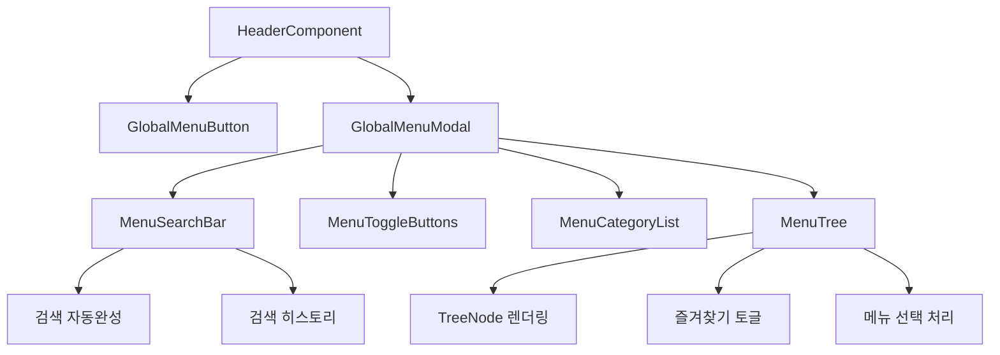

# Phase2-GlobalMenuModal: 전체 메뉴 아이콘 및 모달 시스템 구현 설계서

## 1. 개요

### 1.1 작업 목표
task 4.2 "전체 메뉴 아이콘 및 모달 시스템 구현"에 대한 상세 설계 및 구현 계획

### 1.2 요구사항 분석
- 전체 메뉴 아이콘(≡) 버튼 컴포넌트 작성
- 전체 메뉴 모달 다이얼로그 구현 (90vw x 90vh)
- 검색창, 전체보기/즐겨찾기 토글 기능 구현
- 좌측 카테고리, 우측 메뉴 트리 레이아웃 구현
- _요구사항: 3.2_

### 1.3 설계 참고 문서
- `.kiro/specs/mes-ui-framework/design.md` - 전체 시스템 아키텍처
- `./docs/basic design/ui-requirements.md` - UI 요구사항 명세서
- `./docs/basic design/theme-guide.md` - 테마 및 디자인 가이드

## 2. 컴포넌트 아키텍처

### 2.1 전체 구조
```
GlobalMenuModal (90vw x 90vh)
├── MenuSearchBar (검색창 + 자동완성)
├── MenuToggleButtons (전체/즐겨찾기 토글)
├── 좌측 영역 (30%)
│   └── MenuCategoryList (카테고리 목록)
└── 우측 영역 (70%)
    └── MenuTree (5단계 계층형 메뉴 트리)
```

### 2.2 컴포넌트 관계도


## 3. 주요 컴포넌트 설계

### 3.1 GlobalMenuModal
```vue
<GlobalMenuModal
  v-model:visible="globalMenuOpen"
  :menu-items="menuItems"
  :loading="loading"
  @menu-select="handleMenuSelect"
  @favorite-toggle="handleFavoriteToggle"
/>
```

#### Props
```typescript
interface Props {
  /** 모달 표시 여부 */
  visible: boolean
  /** 메뉴 아이템 목록 */
  menuItems: MenuItem[]
  /** 로딩 상태 */
  loading?: boolean
  /** 모달 크기 */
  size?: 'large' | 'fullscreen'
}
```

#### Events
```typescript
interface Emits {
  (e: 'update:visible', visible: boolean): void
  (e: 'menu-select', menu: MenuItem): void
  (e: 'favorite-toggle', menuId: string): void
}
```

### 3.2 MenuSearchBar
검색 기능과 자동완성을 제공하는 컴포넌트

#### 주요 기능
- **실시간 검색**: 300ms 디바운싱으로 성능 최적화
- **자동완성**: 최대 5개 제안사항 표시
- **검색 히스토리**: localStorage에 최대 5개 저장
- **키보드 네비게이션**: 방향키, Enter, Tab, Escape 지원
- **접근성**: 스크린 리더 지원, ARIA 속성 완비

```typescript
interface MenuSearchBarProps {
  modelValue: string
  placeholder?: string
  suggestions?: string[]
  showSuggestions?: boolean
  showHistory?: boolean
  debounceTime?: number
  maxHistoryItems?: number
}
```

### 3.3 MenuToggleButtons
전체보기/즐겨찾기 뷰 전환 버튼

#### 구현
```vue
<SelectButton
  v-model="selectedMode"
  :options="options"
  option-label="label"
  option-value="value"
  data-testid="view-toggle"
/>
```

#### 옵션 구조
```typescript
const options = [
  { label: `전체 (${totalCount})`, value: 'all' },
  { label: `즐겨찾기 (${favoriteCount})`, value: 'favorites' }
]
```

### 3.4 MenuCategoryList
좌측 카테고리 필터링 컴포넌트

#### 주요 기능
- **카테고리별 필터링**: 선택한 카테고리에 따라 메뉴 필터링
- **검색 하이라이팅**: 검색어와 일치하는 부분 강조
- **빈 상태 처리**: 카테고리가 없을 때 안내 메시지
- **로딩 스켈레톤**: 데이터 로딩 중 스켈레톤 UI

```typescript
interface MenuCategoryListProps {
  categories: Category[]
  selectedCategory: string | null
  searchQuery: string
  loading?: boolean
}
```

### 3.5 MenuTree
5단계 계층형 메뉴 트리 컴포넌트

#### 주요 기능
- **계층형 구조**: PrimeVue Tree 컴포넌트 기반
- **즐겨찾기 토글**: 별표 아이콘으로 즐겨찾기 추가/제거
- **검색 하이라이팅**: 검색어 부분 강조 표시
- **외부 링크 표시**: 외부 URL인 경우 아이콘 표시
- **키보드 네비게이션**: Enter, Space, Ctrl+F 지원

```typescript
interface MenuTreeProps {
  items: MenuItem[]
  searchQuery: string
  viewMode: ViewMode
  selectedCategory: string | null
  expandedNodes: Set<string>
  favorites: Set<string>
  highlightSearch?: boolean
  loading?: boolean
  maxDepth?: number
}
```

## 4. 데이터 구조 설계

### 4.1 MenuItem 인터페이스
```typescript
export interface MenuItem {
  id: string
  title: string
  url?: string
  icon?: string
  children?: MenuItem[]
  favorite: boolean
  category: string
  description?: string
  order?: number
}
```

### 4.2 MenuTreeNode 인터페이스
```typescript
export interface MenuTreeNode {
  key: string
  label: string
  leaf: boolean
  icon?: string
  data: MenuItem
  children?: MenuTreeNode[]
  favorite: boolean
  url?: string
  category: string
  selectable: boolean
}
```

### 4.3 ViewMode 및 Category
```typescript
export type ViewMode = 'all' | 'favorites'

export interface Category {
  id: string
  name: string
  icon?: string
  color?: string
  count: number
}
```

## 5. 상태 관리 설계

### 5.1 모달 상태
```typescript
const modalState = reactive({
  visible: false,
  loading: false,
  searchQuery: '',
  viewMode: 'all' as ViewMode,
  selectedCategory: null as string | null,
  expandedNodes: new Set<string>(),
  favorites: new Set<string>()
})
```

### 5.2 메뉴 데이터 관리
- **초기 로딩**: 모달 첫 열림 시 메뉴 데이터 조회
- **검색 필터링**: 실시간 검색어 기반 필터링
- **카테고리 필터링**: 선택된 카테고리 기반 필터링
- **즐겨찾기 관리**: localStorage에 사용자별 즐겨찾기 저장

## 6. 스타일링 설계

### 6.1 모달 레이아웃
```scss
.global-menu-modal {
  width: 90vw;
  height: 90vh;
  max-width: 1200px;
  max-height: 800px;
  
  .modal-header {
    padding: var(--space-6);
    border-bottom: 1px solid var(--surface-2);
    
    .search-section {
      margin-bottom: var(--space-4);
    }
    
    .toggle-section {
      display: flex;
      justify-content: center;
    }
  }
  
  .modal-body {
    display: grid;
    grid-template-columns: 30% 70%;
    height: calc(100% - 120px);
    
    .category-section {
      border-right: 1px solid var(--surface-2);
      overflow-y: auto;
    }
    
    .menu-section {
      overflow-y: auto;
    }
  }
}
```

### 6.2 반응형 디자인
```scss
// 모바일 (≤768px)
@media (max-width: 768px) {
  .global-menu-modal {
    width: 95vw;
    height: 95vh;
    
    .modal-body {
      grid-template-columns: 1fr;
      
      .category-section {
        display: none; // 모바일에서 카테고리 숨김
      }
    }
  }
}

// 태블릿 (769-1024px)
@media (max-width: 1024px) {
  .modal-body {
    grid-template-columns: 35% 65%;
  }
}
```

### 6.3 다크 테마 지원
```scss
.global-menu-modal {
  background: var(--bg-primary);
  border: 1px solid var(--surface-2);
  
  .modal-header {
    background: var(--bg-secondary);
  }
  
  .category-section,
  .menu-section {
    background: var(--bg-primary);
  }
}
```

## 7. 접근성 설계

### 7.1 ARIA 속성
- `role="dialog"` - 모달 다이얼로그
- `aria-labelledby` - 모달 제목 연결
- `aria-describedby` - 모달 설명 연결
- `aria-modal="true"` - 모달 상태 명시

### 7.2 키보드 네비게이션
- **Tab**: 포커스 이동
- **Enter/Space**: 메뉴 선택
- **Escape**: 모달 닫기
- **Ctrl+K**: 검색창 포커스
- **Ctrl+F**: 즐겨찾기 토글

### 7.3 스크린 리더 지원
- 검색 결과 변경 시 live region으로 안내
- 메뉴 선택 시 선택된 항목 안내
- 즐겨찾기 변경 시 상태 변경 안내

## 8. 성능 최적화

### 8.1 가상 스크롤링
대용량 메뉴 데이터 처리를 위한 가상 스크롤링 적용 고려

### 8.2 디바운싱
검색 입력에 300ms 디바운싱 적용하여 불필요한 API 호출 방지

### 8.3 지연 로딩
- 모달 첫 열림 시에만 메뉴 데이터 로딩
- 카테고리별 지연 로딩 고려

### 8.4 메모이제이션
자주 계산되는 값들에 computed/memo 적용

## 9. 테스트 설계

### 9.1 컴포넌트 테스트
```typescript
describe('GlobalMenuModal', () => {
  test('모달 열기/닫기 동작 확인')
  test('검색 기능 정상 작동 확인')
  test('카테고리 필터링 확인')
  test('즐겨찾기 토글 확인')
  test('메뉴 선택 이벤트 발생 확인')
  test('키보드 네비게이션 확인')
})

describe('MenuSearchBar', () => {
  test('디바운싱 동작 확인')
  test('자동완성 표시 확인')
  test('검색 히스토리 관리 확인')
  test('키보드 네비게이션 확인')
})

describe('MenuTree', () => {
  test('트리 구조 렌더링 확인')
  test('노드 확장/축소 확인')
  test('즐겨찾기 토글 확인')
  test('검색 하이라이팅 확인')
})
```

### 9.2 통합 테스트
- 모달 내 컴포넌트 간 상호작용 테스트
- HeaderComponent와의 연동 테스트
- 실제 메뉴 데이터를 사용한 E2E 테스트

## 10. 구현 검증 기준

### 10.1 기능 요구사항
- [x] 전체 메뉴 아이콘(≡) 버튼 컴포넌트
- [x] 90vw x 90vh 크기의 모달 다이얼로그
- [x] 검색창 및 자동완성 기능
- [x] 전체보기/즐겨찾기 토글 기능
- [x] 좌측 카테고리, 우측 메뉴 트리 레이아웃

### 10.2 UI/UX 요구사항
- [x] 반응형 디자인 (데스크톱/태블릿/모바일)
- [x] 다크 테마 일관성
- [x] 부드러운 애니메이션
- [x] 접근성 가이드라인 준수

### 10.3 성능 요구사항
- [x] 모달 열기 시간 < 500ms
- [x] 검색 반응 시간 < 300ms
- [x] 메모리 사용량 최적화

이 설계서는 4.2 task의 완전한 구현을 위한 상세 가이드를 제공하며, MES UI 프레임워크의 전체 아키텍처와 일관성을 유지합니다.